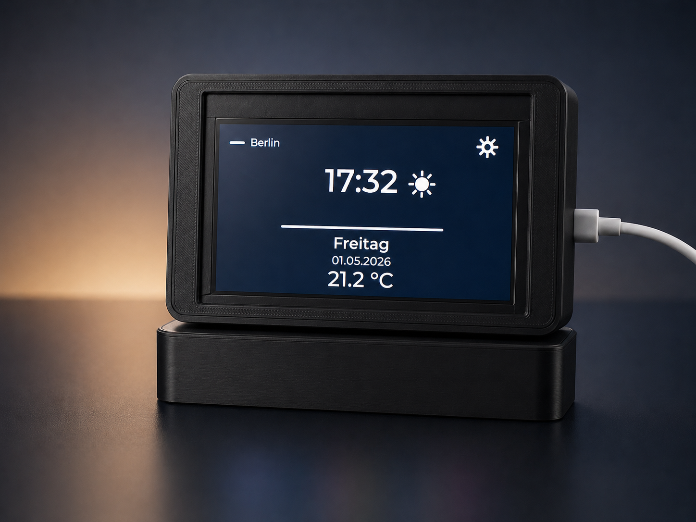
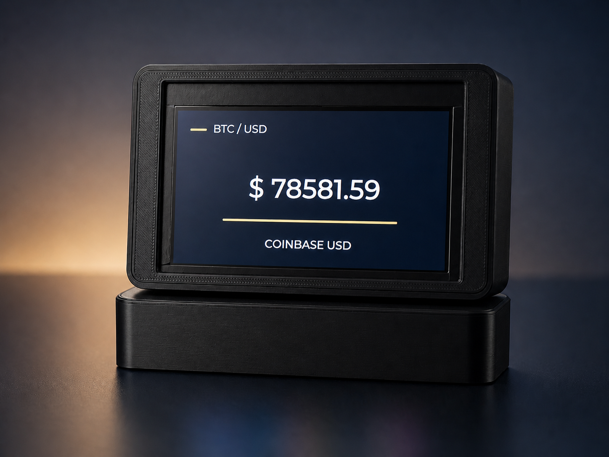
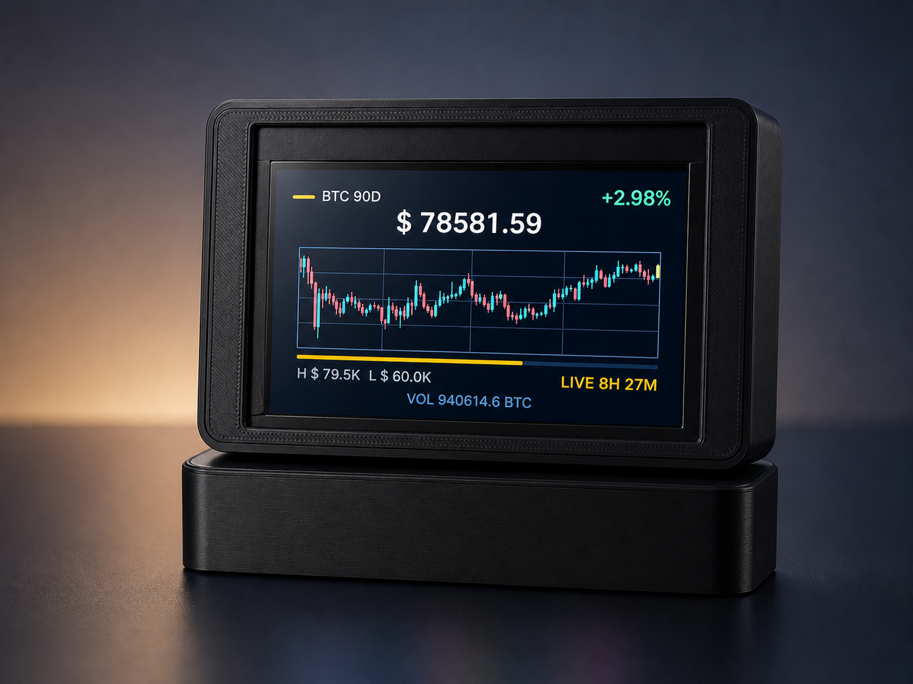

# ESP32-8048S043C Klipper Crypto Weather Panel

Arduino/LVGL dashboard ported to the ESP32-8048S043C 800x480 RGB display. The sketch rotates through local time, weather, live crypto pricing, a 90-day crypto candle chart, and Klipper/Moonraker 3D printer status.

The project is written as a multi-tab Arduino sketch. Open `KlipperCryptoWeatherPanel.ino` in the Arduino IDE, not the numbered `.ino` tabs directly.

## Screenshots

| Time and weather | Live crypto price |
| --- | --- |
|  |  |

| Crypto candle chart | Klipper printer status |
| --- | --- |
|  |  |

## Features

- 800 x 480 LVGL v9 display target for ESP32-8048S043C
- Original 480 x 272 dashboard layout centered on the 800 x 480 panel
- `esp_lcd` RGB panel setup with double framebuffer in PSRAM
- Wi-Fi reconnect handling and serial health diagnostics
- NTP time sync with CET/CEST timezone handling
- Day/night brightness switching based on calculated sunrise and sunset, with a morning delay before day brightness
- Current weather from Bright Sky / DWD data, no weather API key required
- Live crypto spot price from Coinbase
- 90-day daily candle chart from Coinbase Exchange candles
- Klipper/Moonraker status screen for Mainsail-based printers
- Optional MMU gate/status display when Moonraker exposes an `mmu` object
- Private local configuration kept outside Git with `config_private.h`

## Hardware

Target display:

- ESP32-8048S043C ESP32-S3 HMI display
- 800 x 480 RGB565 parallel RGB panel
- Backlight on GPIO 2

The display bus and panel pins are configured in `KlipperCryptoWeatherPanel.ino`:

| Signal | GPIO |
| --- | ---: |
| DE | 40 |
| VSYNC | 41 |
| HSYNC | 39 |
| PCLK | 42 |
| BL | 2 |
| R0..R4 | 45, 48, 47, 21, 14 |
| G0..G5 | 5, 6, 7, 15, 16, 4 |
| B0..B4 | 8, 3, 46, 9, 1 |

The sketch tries to use PSRAM for larger LVGL and chart buffers, with fallbacks to internal RAM where possible. Enable PSRAM in your board settings if your module provides it.

## Software Requirements

- Arduino IDE
- ESP32 Arduino core with ESP32-S3 support
- Libraries:
  - LVGL v9
  - ArduinoJson

Use an ESP32-S3 board profile that matches the ESP32-8048S043C. Typical settings are:

- Board: ESP32S3 Dev Module
- USB CDC On Boot: Disabled when Serial/Upload runs through CH340/UART
- Flash Size: 16MB
- Partition Scheme: 16M Flash (3MB APP/9.9MB FATFS)
- PSRAM: OPI PSRAM

The sketch does not currently use SPIFFS. PSRAM must be enabled because the RGB panel framebuffers and LVGL buffers are allocated there.

## Configuration

Copy the example private configuration:

```powershell
Copy-Item config_private.example.h config_private.h
```

Then edit `config_private.h`:

```cpp
#define WIFI_SSID "YOUR_WIFI_NAME"
#define WIFI_PASSWORD "YOUR_WIFI_PASSWORD"

#define LOCATION_LATITUDE 52.000000f
#define LOCATION_LONGITUDE 13.000000f
#define TIMEZONE_POSIX "CET-1CEST,M3.5.0,M10.5.0/3"

#define CRYPTO_BASE_SYMBOL "BTC"
#define CRYPTO_QUOTE_SYMBOL "USD"
#define CRYPTO_PRICE_PREFIX ""
#define CRYPTO_SERVICE_NAME "COINBASE"

#define KLIPPER_BASE_URL "http://mainsail"
```

`config_private.h` is ignored by Git and should not be uploaded. Keep only `config_private.example.h` in the repository.

`TIMEZONE_POSIX` controls the local time conversion after NTP sync. The example value uses Germany/Central Europe with daylight saving time.

## External Services

The sketch reads data from:

| Service | Purpose | Endpoint |
| --- | --- | --- |
| Bright Sky | Current DWD weather | `https://api.brightsky.dev/current_weather` |
| Coinbase | Live spot price | `https://api.coinbase.com/v2/prices/{BASE}-{QUOTE}/spot` |
| Coinbase Exchange | Daily candles | `https://api.exchange.coinbase.com/products/{BASE}-{QUOTE}/candles` |
| Moonraker | Klipper status | `${KLIPPER_BASE_URL}/server/info`, `/printer/objects/query`, `/server/files/metadata` |

Moonraker access is unauthenticated in this sketch. If your Moonraker instance requires authentication, allow the display on your trusted local network or extend the HTTP requests to send a token.

## Uploading

1. Open `KlipperCryptoWeatherPanel.ino` in the Arduino IDE.
2. Select the correct ESP32-S3 board and port.
3. Confirm that `config_private.h` exists locally.
4. Install the required libraries.
5. Compile and upload.
6. Open the Serial Monitor at `115200` baud for boot diagnostics and API status logs.

## GitHub Checklist

Before pushing the project:

```powershell
git status --short
git check-ignore -v config_private.h
```

`config_private.h` must be reported as ignored. If it appears in `git status`, do not commit it.

Recommended first commit:

```powershell
git init
git add .gitignore *.ino *.h README.md assets images
git status --short
git commit -m "Initial ESP32-S3 HMI dashboard"
```

## Project Layout

| File | Purpose |
| --- | --- |
| `KlipperCryptoWeatherPanel.ino` | Main sketch, display driver setup, global state, setup/loop |
| `01_SystemTime.ino` | Time, sunrise/sunset, brightness, diagnostics, LVGL flush |
| `02_UiWeatherIcon.ino` | LVGL helpers, weather canvas, sun/moon status icon |
| `03_UiScreens.ino` | Time, crypto, candle chart, and Klipper screen layouts |
| `04_BtcChart.ino` | Daily candle chart rendering |
| `05_Network.ino` | Wi-Fi and small JSON extraction helpers |
| `06_BtcData.ino` | Crypto pair formatting, candle storage, candle parsing |
| `07_ApiFetchTask.ino` | Background HTTP fetch task for weather, crypto, and Klipper |
| `08_LvglDisplay.ino` | LVGL display buffer setup |
| `lv_conf.h` | Local LVGL configuration |
| `config_private.example.h` | Safe template for local secrets/settings |
| `assets/icons/` | Editable SVG source assets |
| `images/` | README screenshots of the display and UI screens |
| `src/ui_assets/` | Converted LVGL C image assets used by the sketch |

## Notes

- The UI text is mostly German because this dashboard was built for a German local setup.
- Weather icons use converted LVGL C image assets from `src/ui_assets/`; the SVG files in `assets/icons/` stay as editable source assets.
- The Klipper screen appears only when Moonraker or Klipper status data is reachable.
- API retry intervals and screen timing constants are defined near the top of `KlipperCryptoWeatherPanel.ino`.
