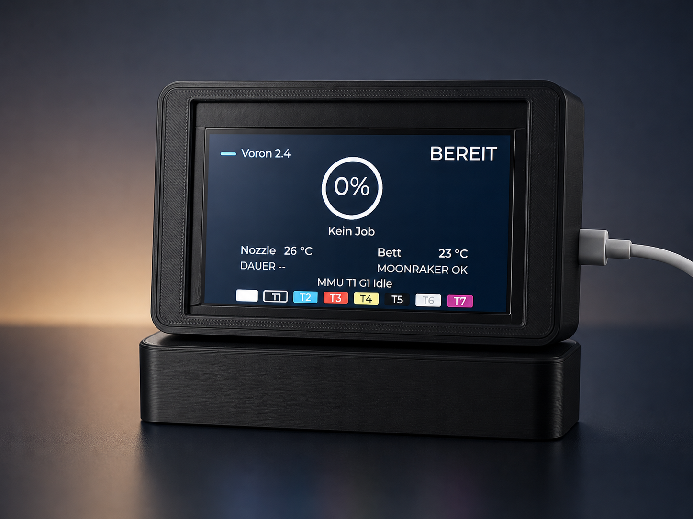

# Guition JC4827W543 ESP32-S3 HMI

Arduino/LVGL dashboard for the Guition JC4827W543 ESP32-S3 display. The sketch rotates through local time, weather, live crypto pricing, a configurable crypto candle chart, and Klipper/Moonraker 3D printer status.

The project is written as a multi-tab Arduino sketch. Open `Guition_JC4827W543.ino` in the Arduino IDE, not the numbered `.ino` tabs directly.

## Screenshots

| Time and weather | Live crypto price |
| --- | --- |
|  |  |

| Crypto candle chart | Klipper printer status |
| --- | --- |
|  |  |

## Features

- 480 x 272 LVGL v9 UI for the Guition JC4827W543 display
- LovyanGFX driver setup for the NV3041A panel
- Wi-Fi reconnect handling and serial health diagnostics
- NTP time sync with CET/CEST timezone handling
- Day/night brightness switching based on calculated sunrise and sunset, with a morning delay before day brightness
- Current weather from Open-Meteo, no weather API key required
- Live crypto spot price from Coinbase
- Configurable candle chart from Coinbase Exchange candles (`15M`, `1H`, `6H`, `1D`)
- Klipper/Moonraker status screen for Mainsail-based printers
- Optional MMU gate/status display when Moonraker exposes an `mmu` object
- Private local configuration kept outside Git with `config_private.h`

## Hardware

Bill of Materials:

Some links may be affiliate links. If you buy through them, I may earn a small commission at no extra cost to you.

| Qty | Part | Source |
| ---: | --- | --- |
| 1 | Guition JC4827W543 ESP32-S3 HMI display | [AliExpress - tested source](https://s.click.aliexpress.com/e/_c3ckN0VN), select `Without Touch`; [Amazon - untested touch version](https://amzn.to/4uCGdZd) |
| 4 | M3x6 cylinder head screws | [Amazon](https://amzn.to/430va00), [AliExpress](https://s.click.aliexpress.com/e/_c3xgcUUx), select `50pcs M3x6mm` |
| 4 | M3 heat-set inserts, 5x4 mm | [Amazon](https://amzn.to/4wgW0P7), [AliExpress](https://s.click.aliexpress.com/e/_c3v6WnvD), `30pcs` |

Target display:

- Guition JC4827W543 ESP32-S3 HMI display
- 480 x 272 NV3041A panel
- Backlight on GPIO 1

The display bus and panel pins are configured in `Guition_JC4827W543.ino`:

| Signal | GPIO |
| --- | ---: |
| SCLK | 47 |
| IO0 | 21 |
| IO1 | 48 |
| IO2 | 40 |
| IO3 | 39 |
| CS | 45 |
| RST | 4 |
| BL | 1 |

The sketch tries to use PSRAM for larger LVGL and chart buffers, with fallbacks to internal RAM where possible. Enable PSRAM in your board settings if your module provides it.

The tested AliExpress board variant is `Without Touch`. The Amazon listing may only offer the touch version of the Guition JC4827W543. Dimensions, connector positions, and pinout appear to match the tested non-touch version, so it is expected to work, but it has not been tested with this build.

## Software Requirements

- Arduino IDE
- ESP32 Arduino core with ESP32-S3 support
- Libraries:
  - LVGL v9
  - LovyanGFX
  - ArduinoJson

Use an ESP32-S3 board profile that matches your Guition display module. Typical settings are:

- Board: ESP32S3 Dev Module
- USB CDC On Boot: Enabled
- Flash Size: 4MB
- Partition Scheme: Huge APP (3MB No OTA/1MB SPIFFS)
- PSRAM: OPI PSRAM

The sketch does not currently use SPIFFS. The Huge APP partition is preferred because this project is flashed manually over USB and does not need OTA update slots.

## Configuration

Copy the example private configuration:

```powershell
Copy-Item config_private.example.h config_private.h
```

Then edit `config_private.h`:

```cpp
#define WIFI_SSID "YOUR_WIFI_NAME"
#define WIFI_PASSWORD "YOUR_WIFI_PASSWORD"

#define LOCATION_LATITUDE 52.000000f
#define LOCATION_LONGITUDE 13.000000f
#define TIMEZONE_POSIX "CET-1CEST,M3.5.0,M10.5.0/3"

#define CRYPTO_BASE_SYMBOL "BTC"
#define CRYPTO_QUOTE_SYMBOL "USD"
#define CRYPTO_PRICE_PREFIX ""
#define CRYPTO_SERVICE_NAME "COINBASE"
#define CRYPTO_CHART_TIMEFRAME "1D"

#define KLIPPER_BASE_URL "http://mainsail"
```

`config_private.h` is ignored by Git and should not be uploaded. Keep only `config_private.example.h` in the repository.

`TIMEZONE_POSIX` controls the local time conversion after NTP sync. The example value uses Germany/Central Europe with daylight saving time.

## External Services

The sketch reads data from:

| Service | Purpose | Endpoint |
| --- | --- | --- |
| Open-Meteo | Current weather | `https://api.open-meteo.com/v1/forecast` |
| BigDataCloud | Reverse geocoding for the weather location name | `https://api.bigdatacloud.net/data/reverse-geocode-client` |
| Coinbase | Live spot price | `https://api.coinbase.com/v2/prices/{BASE}-{QUOTE}/spot` |
| Coinbase Exchange | Configurable candles | `https://api.exchange.coinbase.com/products/{BASE}-{QUOTE}/candles` |
| Moonraker | Klipper status | `${KLIPPER_BASE_URL}/server/info`, `/printer/objects/query`, `/server/files/metadata` |

Moonraker access is unauthenticated in this sketch. If your Moonraker instance requires authentication, allow the display on your trusted local network or extend the HTTP requests to send a token.

## Uploading

1. Open `Guition_JC4827W543.ino` in the Arduino IDE.
2. Select the correct ESP32-S3 board and port.
3. Confirm that `config_private.h` exists locally.
4. Install the required libraries.
5. Compile and upload.
6. Open the Serial Monitor at `115200` baud for boot diagnostics and API status logs.

## GitHub Checklist

Before pushing the project:

```powershell
git status --short
git check-ignore -v config_private.h
```

`config_private.h` must be reported as ignored. If it appears in `git status`, do not commit it.

Recommended first commit:

```powershell
git init
git add .gitignore *.ino *.h README.md assets images
git status --short
git commit -m "Initial ESP32-S3 HMI dashboard"
```

## Project Layout

| File | Purpose |
| --- | --- |
| `Guition_JC4827W543.ino` | Main sketch, display driver setup, global state, setup/loop |
| `01_SystemTime.ino` | Time, sunrise/sunset, brightness, diagnostics, LVGL flush |
| `02_UiWeatherIcon.ino` | LVGL helpers, weather canvas, sun/moon status icon |
| `03_UiScreens.ino` | Time, crypto, candle chart, and Klipper screen layouts |
| `04_BtcChart.ino` | Daily candle chart rendering |
| `05_Network.ino` | Wi-Fi and small JSON extraction helpers |
| `06_BtcData.ino` | Crypto pair formatting, candle storage, candle parsing |
| `07_ApiFetchTask.ino` | Background HTTP fetch task for weather, crypto, and Klipper |
| `08_LvglDisplay.ino` | LVGL display buffer setup |
| `lv_conf.h` | Local LVGL configuration |
| `config_private.example.h` | Safe template for local secrets/settings |
| `assets/icons/` | Editable SVG source assets |
| `images/` | README screenshots of the display and UI screens |
| `src/ui_assets/` | Converted LVGL C image assets used by the sketch |

## Notes

- The UI text is mostly German because this dashboard was built for a German local setup.
- Weather icons use converted LVGL C image assets from `src/ui_assets/`; the SVG files in `assets/icons/` stay as editable source assets.
- The Klipper screen appears only when Moonraker or Klipper status data is reachable.
- API retry intervals and screen timing constants are defined near the top of `Guition_JC4827W543.ino`.
